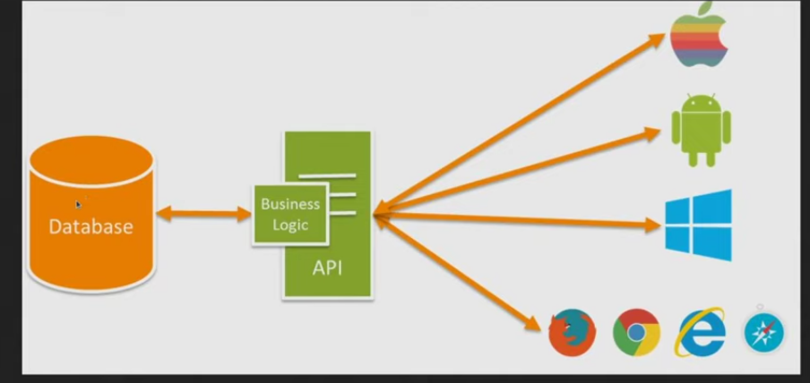

# Oficina APi e Fetch() - Ju Amoasei

Acesse ela [aqui](https://www.youtube.com/watch?v=QcGp2n1PUTE).


## 1. O que é API?

Interface de aplicação. 

INTERFACE:  é um ponto de contato entre duas coisas, que faz com que essas coisas se unam.
 Ex: Tela é uma interface entre o programa e o usário ; entre dois programas diferentes; entre o banco de dados e o programo;
 
 Ex: o site do mercado livre- quando vc vai fazer uma compra lá e clica na opção de "cartão de debito da caixa economica" par efetuar o pagamento, precisa ter uma comunicação entre o mercado livre e a caixa economica. Ao fazer isso, o mercado livre envia uma solicitacao para caixa economica, ela verifica se seus dados e sua conta tá ok e libera para o pagamento.  Ou seja, nesse caso, essa comunicacao entre o mercado e livre a caixa economica é feita atraves de uma API, disponibilizada pela caixa economica para quem quer utilizar esse serviço. 
 
 Ex: VIACEP - API que disponibiliza um serviço fornecer ceps.
 
 ## 2. Como usar?
 
Obs: API do tipo rest (usada no burguer queen): acessa um endereço e ao inves de vir uma pagina, vem um Json, que vcs podem pegar esse json e usar no projeto de vcs. 
 
 Como a gnt passa essas informações de um lugar para o outro, vai variar de API para API.
 
 Obs: XMLHttpRequest: não usa esse metodo para consumir api do tipo rest. É uma forma antiga. Utilize o fetch(). No caso do axios, tb é desnecessáio, o fetch ja faz quase tudo.
 
 Agora no burguer queen, vamos pegar uma API ja pronta para usar. Não queira mudar a api, ela já ta pronta para ser consumida. Se vc for trabalhar num banco, por exemplo, você vai consumir ela já ta pronta, vc não vai mudá-la. 
 
 Cada API tem uma forma de funcionar. É necessário ler a sua documentação para entender a consumí-la.
 
 ## 3. Qual a diferença para banco de dados?
 
 OBS: Firebase abstrai essas coisas(banco de dados e api), coloca essa logica de consumo de API por baixo dos panos. 
 
Banco é o coração da aplicação, é onde ficam guardados todos os dados. O front-end não acessa o banco de dados diretamente. Existe entre a base dados e e o front-end, existe o back-end, que é quem monta as APIs. Da mesma forma que o front-end é uma interface entre o produto inteiro e o usuário, o back-end é uma interface entre a data-base e a aplicação. 



Existe comandos que fazemos para acessar o banco de dados por meio de consulta. O que api/backend faz é -> quando aperto no botão pra acessar um produto no front-end, ele é transformado numa consulta ao banco de dados, o banco de dados devolve essa informação; a API mastiga essas informações do banco, cospe um JSON ; e esse JSON volta pro front-end e vcs colocam esse JSON na pagina, em formato de array, objetos, etc. Isso é o resultado do fetch: qnd vc dá um fetch ele bate na API, bate no banco, o banco retorna e a API retorna o resultado para vocês e isso vai vir em formato de json. 

## 4. Sobre o fetch()

fetch = buscar, trazer.

O retorno do fetch() é sempre uma promessa, que tem que ser resolvida. Por isso que no exemplo abaixo utiliza-se o o then. Dentro do then, resolve as promessas da resposta da requisição. Então, o fetch devolve um objeto promessa, o then resolve essa promessa e ai dps a gnt consegue fazer o que a gente quer com os dados. 

Ex:

````javascript
const myImage = document.querySelector('img');

let myRequest = new Request('flowers.jpg');

fetch(myRequest)
.then(function(response) {
  if (!response.ok) {
    throw new Error(`HTTP error! status: ${response.status}`);
  }
  return response.blob();
})
.then(function(response) {
  let objectURL = URL.createObjectURL(response);
  myImage.src = objectURL;
});
````

 
 
 
