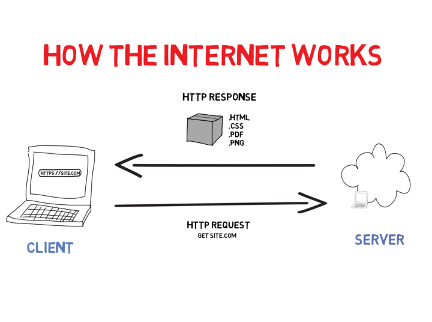
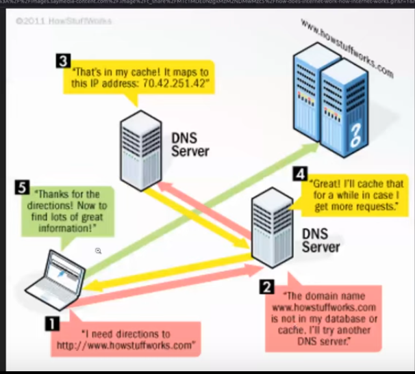

### OFICINA JU AMOASEI - 21.09.22

https://www.youtube.com/watch?v=V-0MEBcibUc

### 1. Web: 

O que é: é a rede onde estamos conectados.
Obs: existem outras redes sem ser a www, como a 'thor'("deeb web"- deep web não existe).

### 2. Como a internet funciona?

Basicamente, o cliente (nosso computador) envia uma requisição para o servidor, via https, para que esses arquivos sejam enviados para o nosso computador. Essa requisição vai bater no disco rígido do servidor, literalmente. E daí, a gente vai receber, por exemplo, o html, css e javascript, e conseguimos acessar isso na tela.

### 3. O que é "http"?

É um protocolo, ou seja, é um conjunto de regras. No caso, "http" é um protocolo de comunicação. Um conjunto de regras que fazem com que o nosso computador consiga fazer requisição de arquivos para o servidor. Existem vários outros protocolos, como por ex, o ftp , sntp (protocolo de emails). 

Http = hypertext transfer protocol (protocolo de transferência de hiper texto). 
Html = hypertext markup language (linguagem de marcação de hiper texto). Eles dois caminham juntos.

Todo endereço, como por exemplo, "www.gatinhos.com", por baixo dos panos, é um número de IP. Esse endereço é para humanos, para as máquinas entenderem, utilizam-se números (IP). 
Antes de chegar no servidor, o navegador faz a requisição para os servidores de DNS, como na imagem acima. Os servidores de DNS são como grandes listas telefonicas, só que sendo listas de endereços, que tem ali "www.gatinhos.com" e o número de IP que ele representa. 
Então, o caminho é: o navegador faz a requisição pro servidor de DNS, pega o número de IP, depois volta pro navegador, e, com a posse do IP, faz a requisição do que ele quer para o servidor. E aí, ele devolve, por exemplo, o html/css/js/pdf pra gente.

No projeto de rede social, nós vamos acessar o banco de dados de servidores do Google que estarão, por exemplo, no Estados Unidos*. E daí, podemos cair em alguns erros. 

*Obs.: Importante lembrar, que esses servidores existem fisicamente em vários lugares do mundo, como por exemplo, na costa dos Estados Unidos, Europa e, também, em São Paulo.

### 4. Verbos HTTP

#### **GET:** ver/pega coisas. 

pegar algo. as requisições que fazemos pelo navegador são sempre do tipo get. Ele sempre quer pegar um dado/um arquivo html e trazer pra gente. É um tipo de requisição que está ligado ao "http". Ex: pegar dados de bancos

#### **POST:** criar coisas.

Ex: tweets, posts

#### **PUT:** mudar/alterar coisas.

Ex: tweets, posts, cadastros

#### **DELETE**: deletar coisas.

Ex: tweets, posts, cadastros.

Obs: existem outros, mas esses são os 4 básicos.

### 5. Erros comuns

https://http.cat/

Toda vez que a gente faz uma requisição para o servidor, a resposta dessa requisição vem acompanhada de um número, como por exemplo, "200 ok" ( a requisição deu certo) . Existem outros códigos que sempre acompanham o retorno de uma requisição. 

Faixa de erro 200: a requisição deu certo.

Faixa de Erro 400: erro de não encontrado. Erro de quem faz a requisição: ou um erro de nao existe.

Erro 500: faixas de erro do servidor. Erro do servidor, ou seja, de quem recebe a requisição.
